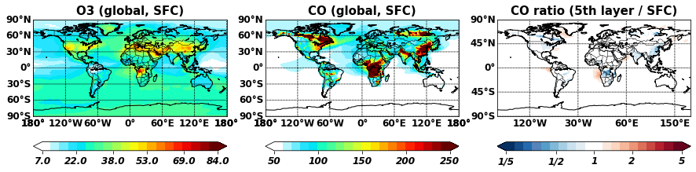

# Custom Colorbar example & alternative method to plot 2D maps
### This code uses "basemap" for 2D map plotting rather than using "cartopy", so it is an alternative method in addtion to cartopy, giving another exmaples in CAM-chem github but please note that "Basemap" package is being deprecated in favor of "Cartopy"
#### This code is only compatible with python 3.x

## Import python libraries
### You also have to download cbar.py, map.py, and cbar directory to run this code
#### cbar.py -> Has a function that reads custom colortable files in "cbar directory"
#### cbar directory -> Has many custom colortable rgb code, you can also add you own RGB colors in this directory
#### map.py -> Has a function to plot 2D map (global, regional, adding observational points)


```python
import xarray as xr                     # For reading NetCDF files
import numpy as np                      # For array manipulations
import matplotlib.pyplot as plt         # For plotting
import matplotlib.cm as cm              # For colorbar
import mpl_toolkits.basemap as basemap  # basemap for shiftgrid funtion
from map import Tvmap                   # Additional function used for 2D map plotting, it uses "Basemap"
from cbar import Cbar                   # Addtional function used for custom colorbar
```

## Read CAM-chem file for this example


```python
# You can change this filename for your own case
filename = '/glade/scratch/cdswk/CAM-chem/archive/f.e21.FHIST.f09_f09_mg17.CMIP6-PRESENT.001/atm/hist/f.e21.FHIST.f09_f09_mg17.CMIP6-PRESENT.001.cam.h0.2013-07.nc'

# Use xarray open_dataset for one file
# for multiple files, you can use open_mfdataset instead
ds = xr.open_dataset( filename )
```

## Rotate longitude axis (Longitude: 0 ~ 360 -> -180 ~ 180) for Tvmap function below


```python
# Make a new directory to store variables in a shifted grid
ds_new = {}

# Shift longitudes by 180 degree
Lon = np.copy(ds.lon)
Lonsize = np.size(Lon)
Lon_new = np.copy(Lon)
Lon_new[:np.int(Lonsize/2)] = Lon[np.int(Lonsize/2):] - 360
Lon_new[np.int(Lonsize/2):] = Lon[:np.int(Lonsize/2)]    
ds_new['lon'] = np.copy(Lon_new)
ds_new['lat'] = np.copy(ds.lat)

# Set tracers to shift by 180 degree in logitudiunal axis
tracers_to_shift = [ 'CO', 'O3' ]
for tr in tracers_to_shift:                 # multiply 1e9 to convert mol/mol to ppbv
    ds_new[tr], londummy = basemap.shiftgrid( 180., ds[tr].values * 1e9, Lon )

```

## Load custom colorbars using cbar function


```python
# Reads myct.rgb file in cbar directory
Cmap_myct = Cbar(Cname='myct')
# Reads myct_buwhrd.rgb file in cbar directory
Cmap_buwhrd = Cbar(Cname='myct_buwhrd')
```

## Make three plots using Tvmap function
### O3, CO, and O3/CO


```python
# Set canvas size
fig = plt.figure( figsize=(15,6))

# First panel of three panels
ax = fig.add_subplot(1,3,1)

# Keywords passed to contourf function in Tvmap
contourfkwds = {}
# Set colorbar
contourfkwds['cmap'] = Cmap_myct.cmap
# Colorbar edge option
contourfkwds['extend'] = 'both'
# Set title
ax.set_title( 'O3 (global, SFC)', fontsize=15, weight='semibold')
# Call Tvmap function for 2D global map
Tvmap( ds_new['O3'][0,-1,:,:],
       division=21, Nticks=6,
       contourfkwds=contourfkwds )


ax2 = fig.add_subplot(1,3,2)
# Keywords passed to contourf function in Tvmap
contourfkwds = {}
# Set colorbar
contourfkwds['cmap'] = Cmap_myct.cmap
# Colorbar edge option
contourfkwds['extend'] = 'both'
# Set title
ax2.set_title( 'CO (global, SFC)', fontsize=15, weight='semibold')
# if you want to have custom colorticks
maxdata = 250
mindata = 50
colorticks = [50, 100, 150, 200, 250]
# Call Tvmap function for 2D global map
Tvmap( ds_new['CO'][0,-1,:,:],
       mindata=mindata, maxdata=maxdata,
       colorticks=colorticks, colorlabels=colorticks,
       division=21, Nticks=5,
       contourfkwds=contourfkwds )


ax = fig.add_subplot(1,3,3)
contourfkwds = {}
contourfkwds['cmap'] = Cmap_buwhrd.cmap
contourfkwds['extend'] = 'both'
ax.set_title( 'CO ratio (5th layer / SFC)', weight='semibold', size=15)
# ratio map in log space
ratio_map = np.log10( ds_new['CO'][0,-5,:,:] / ds_new['CO'][0,-1,:,:] )

Tv4 = Tvmap( ratio_map,
             latinterval=45, loninterval=90, # For custom lat/lon grids
             mindata=-0.69897, maxdata=0.69897,
             division=21, Nticks=5, diff=True,
             colorticks = np.array([ -0.69897, -0.30103, 0.0, 0.30103, 0.69897 ]),
             colorlabels = np.array([ "1/5", "1/2", "1", "2", "5" ]),
             contourfkwds=contourfkwds)

# In case if you want to save the output to the png file, uncomment the below line
#plt.savefig('Colorbar_and_Tvmap_example.png' )

```




