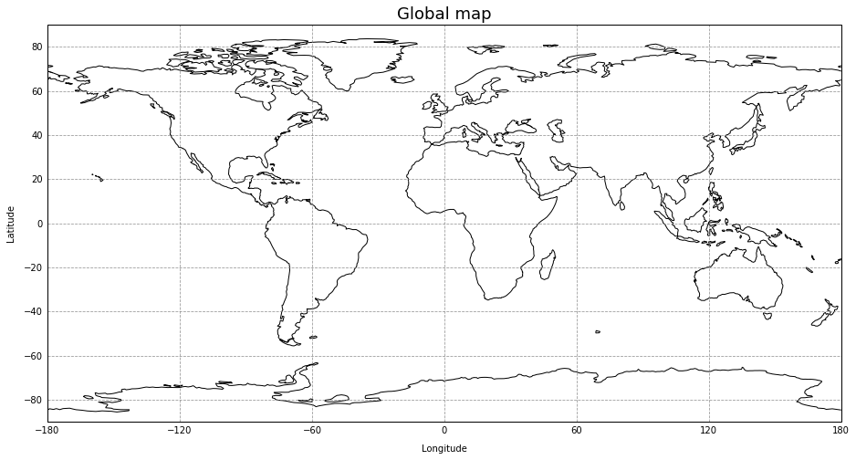

# Plot Maps

[world map with coastlines   ](jupyter_notebook_examples/plot_map_basic.md) [model output as contours](jupyter_notebook_examples/plot_map_basic_co.md) 

[define contours and colorbar](https://nbviewer.jupyter.org/github/NCAR/CAM-chem/blob/master/docs/jupyter_notebook_examples/plot_map.ipynb) 

[add cyclic point](https://nbviewer.jupyter.org/github/NCAR/CAM-chem/blob/master/docs/jupyter_notebook_examples/plot_map.ipynb) 

[zoom into region](https://nbviewer.jupyter.org/github/NCAR/CAM-chem/blob/master/docs/jupyter_notebook_examples/plot_map.ipynb) 

[add location points](https://nbviewer.jupyter.org/github/NCAR/CAM-chem/blob/master/docs/jupyter_notebook_examples/plot_map.ipynb) 
