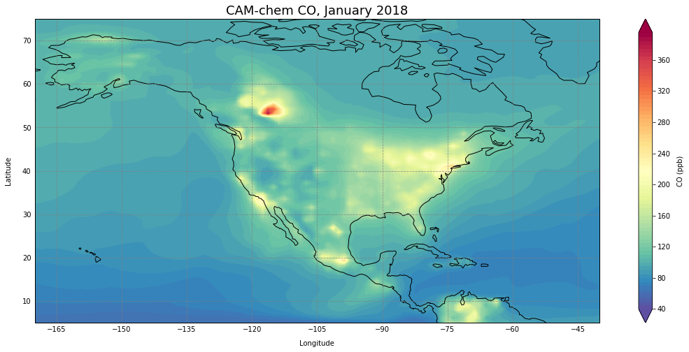
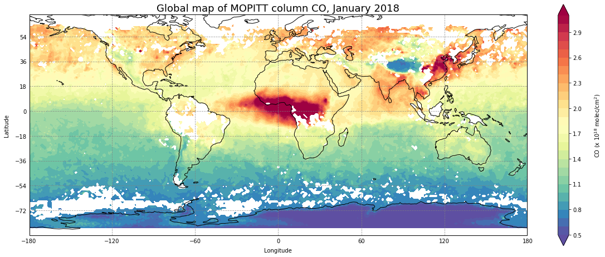

# Plot Maps

This section describes some ways to plot model output on maps.

| <!-- -->| <!-- --> | <!-- --> |  <!-- --> |
|:-------------:|:-------------:|:-------------:|:-------------:|
| [world map with coastlines   ](jupyter_notebook_examples/maps/plot_map_basic.md) | [alternate projection   ](jupyter_notebook_examples/maps/plot_projection_conus.md) | [model output as contours   ](jupyter_notebook_examples/maps/plot_map_basic_co.md) | [define contours and colorbar   ](jupyter_notebook_examples/maps/plot_map_basic_co_cbar.md)
| [remove white stripe   ](jupyter_notebook_examples/maps/plot_map_basic_co_cbar_cyclic.md) | [zoom into region   ](jupyter_notebook_examples/maps/plot_map_basic_co_cbar_region.md)  | [add location points  ](jupyter_notebook_examples/maps/plot_map_basic_co_cbar_region_points.md) | [add observation points]()
| [convert to column values  ](jupyter_notebook_examples/maps/plot_map_basic_co_column.md) |[gridded satellite data  ](jupyter_notebook_examples/maps/plot_map_basic_co_satellite.md) | [difference plot]() |[create callable plotting function]() |
|[sub plots]() |

