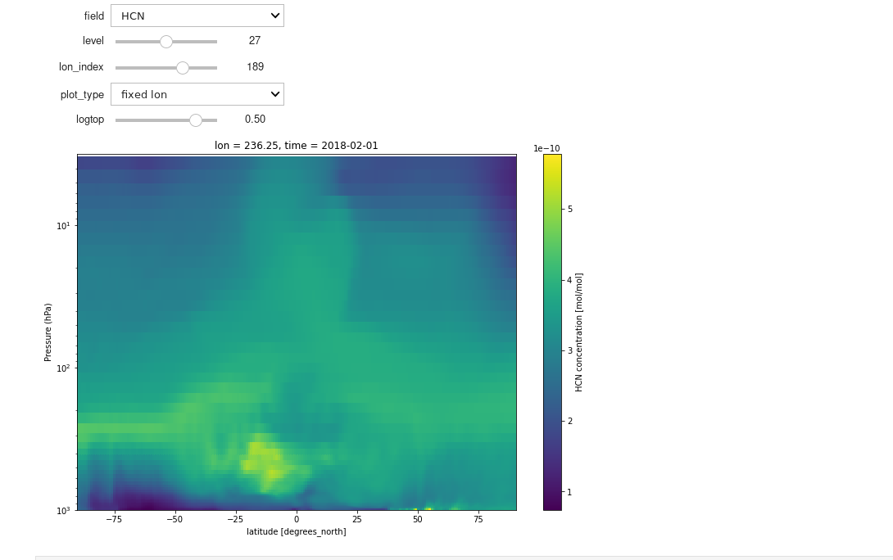

# Create a widget for a quicklook at model output
Provides options to look at output along various altitude slices of lat/lon plots, zonal averages or longitude vs altitude slices.

```python
# Dan Marsh, 2020-08-12
# Widget to help navigate through some varables in your output files.
```

### Load python packages


```python
import matplotlib.pyplot as plt
import numpy as np
import xarray as xr
from ipywidgets import interactive
```

### Load file


```python
archive_dir = '/glade/work/buchholz/CAM_chem_output/'
ds = xr.open_dataset(archive_dir+'CAM_chem_merra2_FCSD_1deg_QFED_monthly_2018.nc')
ntime = ds['time'].size
nlon = ds['lon'].size
nlev = ds['lev'].size
```

### Create reusable functions


```python
def plt_field(field, time_index, level, lon_index, plot_type, logtop):
    plt.figure(figsize=(12,8))
    
    var = ds[field]
    
    if (var.dims == ('time','lev', 'lat', 'lon')):
        
        var1 = var.isel(time=time_index)
        
        if (plot_type == 'lon-lat'):
            var1[level,:,:].plot.imshow()
        elif (plot_type == 'zonal mean'):
            a = var1.mean(dim='lon')
            a.where(ds.coords["lev"] > 10**logtop).plot.pcolormesh()
            ax = plt.gca()
            ax.set_ylim([1000,10**logtop])
            ax.set_yscale('log')
            ax.set_ylabel('Pressure (hPa)')
        elif (plot_type == 'fixed lon'):
            a = var1[:,:,lon_index]
            a.where(ds.coords["lev"] > 10**logtop).plot.pcolormesh()
            ax = plt.gca()
            ax.set_ylim([1000,10**logtop])
            ax.set_yscale('log')
            ax.set_ylabel('Pressure (hPa)')
    elif (var.dims == ('time', 'lat', 'lon')):
        var[time_index,:,:].plot.imshow()
    else:
        plt.scatter((0,360),(-90,90))
        plt.text(180, 0, 'select a 2-D or 3-D field', horizontalalignment='center')
    
    plt.show()
    
    return
```

### Call the widget


```python
w = interactive(plt_field, field=ds.data_vars.keys(), 
          time_index = (0,ntime-1,1),
          level=(0,nlev-1,1),
          lon_index = (0,nlon-1,1),
          plot_type=['lon-lat', 'zonal mean', 'fixed lon'], 
          logtop=(-5,2,0.5))

output = w.children[-1]
output.layout.height = '500px'
display(w)
```




