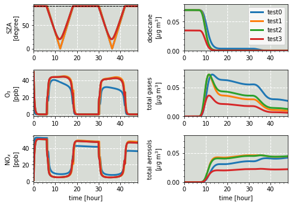

# Input and Output 

This section describes examples, tips and tricks for loading and writing various files.

| <!-- -->| <!-- --> | 
|:-------------:|:-------------:|
| [load multiple csv and join   ](jupyter_notebook_examples/io/Read_csv_dataframe.md) | [load ict files   ](jupyter_notebook_examples/io/Read_ict_dataframe_demo_NASA_ATom.md) | 
