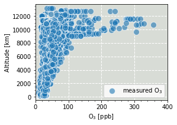

# Load ict type files


```python
# ====================================================================
# This simple jupyter notebook demonstrates:
#   - How to load ict file(s)
#   - How to pack data into dataframe, and how to manipulate dataframe
# By: Siyuan Wang (siyuan@ucar.edu) 13 August 2020
# ====================================================================
```

### Import packages


```python
import pandas as pd
import numpy as np
import os
import fnmatch

from mpl_toolkits.basemap import Basemap
import matplotlib.pyplot as plt
```

### Define reusable functions


```python
# =====================================================================
# A few utility functions for ict file
# see https://www-air.larc.nasa.gov/missions/etc/IcarttDataFormat.htm
#    - extract_ict2: load certain parameter from an ict file
#    - extract_ict2_batch: load same parameter from a list of ict files
# =====================================================================

def extract_ict2(parameter2extract, ict_path_file):
    # --------------
    # Read the  file
    # --------------
    f_ict        = open(ict_path_file, "r")
    ict_contents = f_ict.readlines()
    f_ict.close()
    # ---------------------------------------------------------------
    # Find the header: 
    # for ict format, line index of header is given in the first line
    # ---------------------------------------------------------------
    header_line_ind = -1+int(ict_contents[0].split(',')[0])
    FileHeaderKeyword = ict_contents[header_line_ind]
    for i in range(len(ict_contents)):
        # if (ict_contents[i].find(FileHeaderKeyword) != -1): 
        ict_contents_squeeze = ict_contents[i].replace(' ,', ',').replace(', ', ',')
        # print(ict_contents_squeeze)
        if (ict_contents_squeeze.find(FileHeaderKeyword) != -1): 
            ict_header = ict_contents_squeeze
            ict_header_lineind = i
            break
    ict_contents = ict_contents[ict_header_lineind+1:]    # Chop off header
    ict_header = ict_header.split(',')                    # Chop header into pieces
    parameter_index = ict_header.index(parameter2extract) # Get the col index for the parameter
    # -------------------------
    # Now extract the parameter
    # -------------------------
    parameter_temp = ict_contents
    for i in range(len(ict_contents)): parameter_temp[i] = float(ict_contents[i].split(',')[parameter_index])
    return parameter_temp
    del parameter_temp
    del ict_contents

def extract_ict2_batch(parameter2extract, ict_path, wildcard):
    # -----------------------------------------------------------
    # note: use sorted(os.listdir()) 
    # otherwise the filelist will be in random order. annoying!!!
    # -----------------------------------------------------------
    ict_filelist = [ict_path+"/"+f for f in sorted(os.listdir(ict_path)) if fnmatch.fnmatch(f, wildcard)]
    for i in range(len(ict_filelist)):
        if i==0:
            parameter2extract_temp = extract_ict2(parameter2extract, ict_filelist[i])
        else:
            parameter2extract_temp.extend(extract_ict2(parameter2extract, ict_filelist[i]))
    return parameter2extract_temp
    del parameter2extract_temp
```

### Input file location and template


```python
# ===========================================================
# Read ATom-1 merge files
# NASA ATom field campaign MERGE data available: 
# https://espo.nasa.gov/atom/archive/browse/atom/DC8/MER-TOGA
# ===========================================================
ict_path     = '/glade/work/siyuan/ATom1_flighttracks/TOGA_merge_20190918'
ict_wildcard = "MER-TOGA_DC8_*.ict"
```

### Load the variables from the ict files


```python
# ---------------------------------------------------------------------
# Build ATom1 merge lists
# The MERGE files contain A LOT OF variables. We don't need all of them
# This lists only the variables we're interested in
# ---------------------------------------------------------------------
variable_list = ['Day_Of_Year', 'UTC_Mean_1s', 'P', 'T', 'G_LAT', 'G_LONG', 'G_ALT', 
                 'NO_CL', 'NO2_CL', 'O3_CL', 'HCN_TOGA', 'CH3CN_TOGA', 'CO.X']

# ------------------------------------------------
# Now load these variables: simply a list of lists
# ------------------------------------------------
variable_arrays = [extract_ict2_batch(v, ict_path, ict_wildcard) for v in variable_list]  

# ---------------------------------------
# Pack the list of lists into a dataframe
# ---------------------------------------
ATom1_Merge = pd.DataFrame(variable_arrays)

# --------------------------------------------------------------------
# At this point, the dataframe doesn't have "header"
# We can add "variable_list" but need to transpose the dataframe first
# --------------------------------------------------------------------
ATom1_Merge = ATom1_Merge.transpose()
ATom1_Merge.columns = variable_list
del(variable_arrays)

```

### Calculations


```python
# --------------------------------
# You can do some quick conversion
# --------------------------------
ATom1_Merge['DoY_FracDay'] = ATom1_Merge['Day_Of_Year'] + ATom1_Merge['UTC_Mean_1s']/86400
ATom1_Merge['G_ALT'] = ATom1_Merge['G_ALT'] / 1000.0
ATom1_Merge['G_LONG'] = np.where(ATom1_Merge['G_LONG']<0.0, 360.0+ATom1_Merge['G_LONG'], ATom1_Merge['G_LONG'])

# --------------------------------------------
# You can add new columns to the dataframe too
# --------------------------------------------
ATom1_Merge['NOx_CL'] = ATom1_Merge['NO_CL'] + ATom1_Merge['NO2_CL']

# ------------------------------
# You can sort the dataframe too
# ------------------------------
ATom1_Merge.sort_values(by=['DoY_FracDay'])
```


<div>
<style scoped>
    .dataframe tbody tr th:only-of-type {
        vertical-align: middle;
    }

    .dataframe tbody tr th {
        vertical-align: top;
    }

    .dataframe thead th {
        text-align: right;
    }
</style>
<table border="1" class="dataframe">
  <thead>
    <tr style="text-align: right;">
      <th></th>
      <th>Day_Of_Year</th>
      <th>UTC_Mean_1s</th>
      <th>P</th>
      <th>T</th>
      <th>G_LAT</th>
      <th>G_LONG</th>
      <th>G_ALT</th>
      <th>NO_CL</th>
      <th>NO2_CL</th>
      <th>O3_CL</th>
      <th>HCN_TOGA</th>
      <th>CH3CN_TOGA</th>
      <th>CO.X</th>
      <th>DoY_FracDay</th>
      <th>NOx_CL</th>
    </tr>
  </thead>
  <tbody>
    <tr>
      <th>0</th>
      <td>211.0</td>
      <td>52582.5</td>
      <td>818.035556</td>
      <td>300.421667</td>
      <td>34.706957</td>
      <td>241.936265</td>
      <td>1.864653</td>
      <td>0.045872</td>
      <td>-99999.000000</td>
      <td>71.487389</td>
      <td>654.0</td>
      <td>495.0</td>
      <td>231.047779</td>
      <td>211.608594</td>
      <td>-99998.954127</td>
    </tr>
    <tr>
      <th>1</th>
      <td>211.0</td>
      <td>52702.5</td>
      <td>728.876111</td>
      <td>292.418056</td>
      <td>34.660183</td>
      <td>242.081350</td>
      <td>2.868872</td>
      <td>0.074238</td>
      <td>-99999.000000</td>
      <td>59.310528</td>
      <td>315.0</td>
      <td>199.9</td>
      <td>112.715217</td>
      <td>211.609983</td>
      <td>-99998.925762</td>
    </tr>
    <tr>
      <th>2</th>
      <td>211.0</td>
      <td>52822.5</td>
      <td>672.321667</td>
      <td>286.812778</td>
      <td>34.507256</td>
      <td>241.977906</td>
      <td>3.550958</td>
      <td>0.034808</td>
      <td>-99999.000000</td>
      <td>55.356606</td>
      <td>304.0</td>
      <td>196.9</td>
      <td>101.625694</td>
      <td>211.611372</td>
      <td>-99998.965192</td>
    </tr>
    <tr>
      <th>3</th>
      <td>211.0</td>
      <td>52942.5</td>
      <td>592.500556</td>
      <td>278.068611</td>
      <td>34.338173</td>
      <td>241.856258</td>
      <td>4.597761</td>
      <td>0.026278</td>
      <td>-99999.000000</td>
      <td>49.883250</td>
      <td>270.0</td>
      <td>195.2</td>
      <td>99.602417</td>
      <td>211.612760</td>
      <td>-99998.973722</td>
    </tr>
    <tr>
      <th>4</th>
      <td>211.0</td>
      <td>53062.5</td>
      <td>531.152500</td>
      <td>270.208889</td>
      <td>34.208883</td>
      <td>241.689937</td>
      <td>5.476819</td>
      <td>0.067331</td>
      <td>-99999.000000</td>
      <td>50.795611</td>
      <td>273.0</td>
      <td>187.5</td>
      <td>94.231361</td>
      <td>211.614149</td>
      <td>-99998.932669</td>
    </tr>
    <tr>
      <th>...</th>
      <td>...</td>
      <td>...</td>
      <td>...</td>
      <td>...</td>
      <td>...</td>
      <td>...</td>
      <td>...</td>
      <td>...</td>
      <td>...</td>
      <td>...</td>
      <td>...</td>
      <td>...</td>
      <td>...</td>
      <td>...</td>
      <td>...</td>
    </tr>
    <tr>
      <th>2687</th>
      <td>236.0</td>
      <td>71422.5</td>
      <td>716.105833</td>
      <td>286.034444</td>
      <td>34.979391</td>
      <td>242.335362</td>
      <td>3.028783</td>
      <td>0.026259</td>
      <td>0.065020</td>
      <td>57.266139</td>
      <td>494.0</td>
      <td>331.5</td>
      <td>164.160250</td>
      <td>236.826649</td>
      <td>0.091279</td>
    </tr>
    <tr>
      <th>2688</th>
      <td>236.0</td>
      <td>71542.5</td>
      <td>776.480556</td>
      <td>291.110833</td>
      <td>34.864078</td>
      <td>242.330712</td>
      <td>2.344622</td>
      <td>0.023763</td>
      <td>0.051745</td>
      <td>51.896111</td>
      <td>419.0</td>
      <td>228.4</td>
      <td>-99999.000000</td>
      <td>236.828038</td>
      <td>0.075508</td>
    </tr>
    <tr>
      <th>2689</th>
      <td>236.0</td>
      <td>71662.5</td>
      <td>843.598611</td>
      <td>296.894722</td>
      <td>34.754821</td>
      <td>242.230459</td>
      <td>1.630394</td>
      <td>0.078565</td>
      <td>0.242159</td>
      <td>68.974639</td>
      <td>558.0</td>
      <td>365.3</td>
      <td>-99999.000000</td>
      <td>236.829427</td>
      <td>0.320724</td>
    </tr>
    <tr>
      <th>2690</th>
      <td>236.0</td>
      <td>71782.5</td>
      <td>847.694722</td>
      <td>297.196944</td>
      <td>34.654233</td>
      <td>242.136274</td>
      <td>1.587917</td>
      <td>0.096113</td>
      <td>0.300429</td>
      <td>66.078250</td>
      <td>548.0</td>
      <td>336.0</td>
      <td>-99999.000000</td>
      <td>236.830816</td>
      <td>0.396541</td>
    </tr>
    <tr>
      <th>2691</th>
      <td>236.0</td>
      <td>71901.5</td>
      <td>881.643611</td>
      <td>300.233889</td>
      <td>34.637538</td>
      <td>242.013709</td>
      <td>1.251483</td>
      <td>0.133308</td>
      <td>0.399248</td>
      <td>63.132139</td>
      <td>550.0</td>
      <td>331.0</td>
      <td>-99999.000000</td>
      <td>236.832193</td>
      <td>0.532557</td>
    </tr>
  </tbody>
</table>
<p>2692 rows × 15 columns</p>
</div>


```python
# =====================================================================
# You can do some filtering: will apply to all columns in the dataframe
# This is quite handy
# =====================================================================
# Remove anthropogenic influence and "bad points"
ATom1_Merge.drop( ATom1_Merge[ (ATom1_Merge['CO.X']>=90.0) | (ATom1_Merge['CO.X']<0.0) ].index, inplace=True )
# Remove biomass burning and "bad points"
ATom1_Merge.drop( ATom1_Merge[ (ATom1_Merge['HCN_TOGA']>=350.0) | (ATom1_Merge['HCN_TOGA']<0.0) ].index, inplace=True )
ATom1_Merge.drop( ATom1_Merge[ (ATom1_Merge['CH3CN_TOGA']>=200.0) | (ATom1_Merge['CH3CN_TOGA']<0.0) ].index, inplace=True )

```

### Quick plots to check


```python
# ======================================
# now make a quick vertical profile plot
# ======================================
fig, axs = plt.subplots(figsize=(4,3))
plt.plot(ATom1_Merge['O3_CL'], ATom1_Merge['G_ALT'], 
         'C0o', alpha=0.6, markersize=10, markeredgecolor="white", markeredgewidth=1)
plt.xlim([0, 400])
plt.ylabel('Altitude [km]')
plt.xlabel('O$_3$ [ppb]')
plt.legend(['measured O$_3$'], loc='lower right')
plt.grid(color='white', linestyle='--', linewidth=1)
plt.minorticks_on()
axs.set_facecolor('xkcd:light grey')  # make it pretty...
```





```python

```
