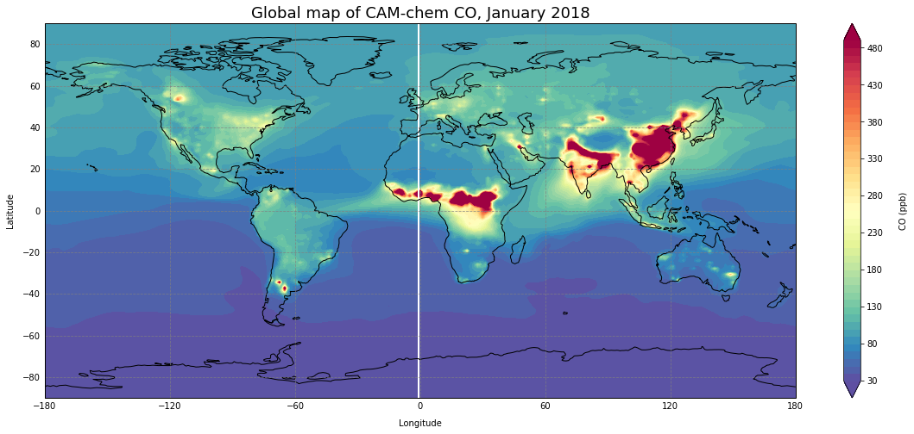

.. Python collection for CAM-chem documentation emissions file, created by
   rrb on Mon Feb 15, 2021.

======================
Emissions processing
======================

This section describes some ways to plot model output on maps.

.. list-table::
   :widths: 20 20 20 20
   :header-rows: 0

   * - | `regridding finite volume`
       | |map_img_4|
     - | `regridding xpectral element`
       | 
     - | `creating qfed emissions`
       | 
     - | 
       | 

.. toctree::
   :hidden:
   :maxdepth: 1

