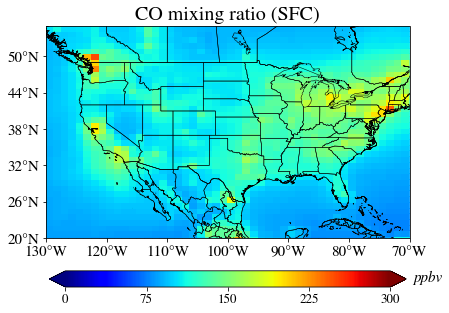
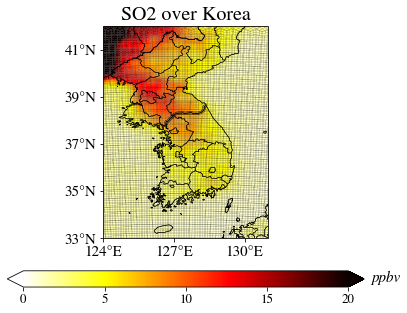

.. Python collection for CAM-chem documentation maps file, created by
   rrb on Mon Feb 15, 2021.

=======
Maps
=======

This section describes some ways to plot model output on maps.

.. |map_img_1| image:: maps/plot_map_basic_files/plot_map_basic_5_0.png
   :width: 200px
.. |map_img_2| image:: maps/plot_projection_conus_files/plot_projection_conus_1_1.png
   :width: 200px
.. |map_img_3| image:: maps/plot_map_basic_co_files/plot_map_basic_co_9_0.png
   :width: 200px
.. |map_img_4| image:: maps/plot_map_basic_co_cbar_files/plot_map_basic_co_cbar_9_0.png
   :width: 200px
.. |map_img_5| image:: maps/plot_map_basic_co_cbar_cyclic_files/plot_map_basic_co_cbar_cyclic_11_0.png
   :width: 200px
.. |map_img_6| image:: maps/plot_map_basic_co_cbar_region_files/plot_map_basic_co_cbar_region_9_0.png
   :width: 200px
.. |map_img_7| image:: maps/plot_map_basic_co_cbar_region_points_files/plot_map_basic_co_cbar_region_points_11_0.png
   :width: 200px
.. |map_img_9| image:: maps/plot_map_basic_co_column_files/plot_map_basic_co_column_17_0.png
   :width: 200px
.. |map_img_10| image:: maps/plot_map_basic_co_satellite_files/plot_map_basic_co_satellite_11_0.png
   :width: 200px

  
.. list-table::
   :widths: 20 20 20 20
   :header-rows: 0

   * - | `map outlines <maps/plot_map_basic.html>`_
       | |map_img_1|
     - | `alternate projection <maps/plot_projection_conus.html>`_
       | |map_img_2|
     - | `model output as contours <maps/plot_map_basic_co.html>`_
       | |map_img_3|
     - | `define contour levels <maps/plot_map_basic_co_cbar.html>`_
       | |map_img_4|
   * - | `remove while stripe at dateline <maps/plot_map_basic_co_cbar_cyclic.html>`_
       | |map_img_5|
     - | `zoom into region <maps/plot_map_basic_co_cbar_region.html>`_
       | |map_img_6|
     - | `add location points <maps/plot_map_basic_co_cbar_region_points.html>`_
       | |map_img_7|
     - | add observation values at points
       |
   * - | `convert to column values <maps/plot_map_basic_co_column.html>`_
       | |map_img_9|
     - | `gridded satellite data <maps/plot_map_basic_co_satellite.html>`_
       | |map_img_10|
     - | difference plot
       |
     - | using the basemap library/package
       |

.. toctree::
   :hidden:
   :maxdepth: 1

   Map outline <maps/plot_map_basic>
   Plot Tracer <maps/plot_map_basic_co>
   CONUS projection <maps/plot_projection_conus>
   Adjust contours <maps/plot_map_basic_co_cbar>
   Remove dateline gap <maps/plot_map_basic_co_cbar_cyclic>
   Zoom to region <maps/plot_map_basic_co_cbar_region>
   Add locations <maps/plot_map_basic_co_cbar_region_points>
   Column values <maps/plot_map_basic_co_column>
   Satellite <maps/plot_map_basic_co_satellite>

------------

Examples using the `Plot_2D function <functions/Plot_2D.html>`_

.. |Plot_2D_ex1| image:: maps/Plot_2D_example_1_global_map_files/Plot_2D_example_1_global_map_15_1.png
   :width: 200px

   
.. list-table::
   :widths: 20 20 20 20
   :header-rows: 0

   * - | `Global map [FV grid] <maps/Plot_2D_example_1_global_map.html>`_
       | |Plot_2D_ex1|
     - | `Regional map [FV grid] <maps/Plot_2D_example_2_regional_map.html>`_
       | |Plot_2D_ex2|
     - | `Global/Regional map [SE(-RR) grid] <maps/Plot_2D_example_3_SE_RR_map.html>`_
       | |Plot_2D_ex3|
     - | Log scale map
       |
   * - | Adding a marker on a map
       |
     - | Multi-panel with PLot_2D
       |
     - | TBD
       |
     - | TBD
       |

.. toctree::
   :hidden:
   :maxdepth: 1

   Plot2D: Global FV <maps/Plot_2D_example_1_global_map>
   Plot2D: Regional FV <maps/Plot_2D_example_2_regional_map>
   Plot2D: Regional SE <maps/Plot_2D_example_3_SE_RR_map>

