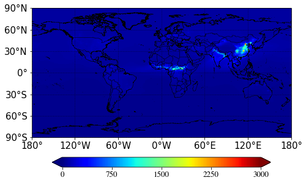
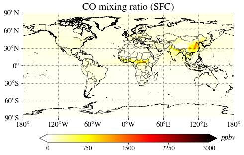

Plot a global map from finite volume (FV) grid field (Plot_2D application)
==========================================================================

.. code:: ipython3

    # By line: DSJ 10-MAR-2021
    # Script aims to:
    # - Plot a world map with coastlines, lon/lat lines, and colorbar
    # - Change colormap of the plot
    # - Add unit to the plot
    # - Add title to the plot
    # - Manually set maximum and minimum values of the plot

At the start of a Jupyter notebook you need to import all modules that you will use
-----------------------------------------------------------------------------------

.. code:: ipython3

    # Make sure you have downloaded "Plot_2D.py" script from Github
    from Plot_2D import Plot_2D
    import xarray as xr # To read NetCDF file
    import matplotlib.cm as cm # To change colormap used in plots

Read the sample file
--------------------

.. code:: ipython3

    # Make sure you have downloaded "sample.nc" file from Github
    ds = xr.open_dataset( 'sample.nc' )

Call Plot_2D script to plot surface CO
--------------------------------------

.. code:: ipython3

    Plot_2D( ds['CO'][0,-1,:,:]*1e9 ) # multiply by 1e9 to make it to ppbv

.. parsed-literal::

    <Plot_2D.Plot_2D at 0x28746bb9b88>

You can specify colormap. For more information, you can check colormaps from here: https://matplotlib.org/stable/tutorials/colors/colormaps.html
------------------------------------------------------------------------------------------------------------------------------------------------

.. code:: ipython3

    Plot_2D( ds['CO'][0,-1,:,:]*1e9, cmap=cm.hot_r )

.. parsed-literal::

    <Plot_2D.Plot_2D at 0x2874c3c5588>

.. image:: Plot_2D_example_1_global_map_files/Plot_2D_example_1_global_map_9_1.png

Let’s add an unit to the plot by using unit keyword
---------------------------------------------------

.. code:: ipython3

    Plot_2D( ds['CO'][0,-1,:,:]*1e9, cmap=cm.hot_r, unit='ppbv' )

.. parsed-literal::

    <Plot_2D.Plot_2D at 0x2874c655a08>

.. image:: Plot_2D_example_1_global_map_files/Plot_2D_example_1_global_map_11_1.png

You can also add a title to the plot
------------------------------------

.. code:: ipython3

    Plot_2D( ds['CO'][0,-1,:,:]*1e9, cmap=cm.hot_r, unit='ppbv', title='CO mixing ratio (SFC)' )

.. parsed-literal::

    <Plot_2D.Plot_2D at 0x2874c71ac48>

Set maximum and minimum values manually with cmin and cmax keywords
-------------------------------------------------------------------

.. code:: ipython3

    Plot_2D( ds['CO'][0,-1,:,:]*1e9, cmap=cm.hot_r, unit='ppbv', title='CO mixing ratio (SFC)',
             cmax=1000, cmin=100 )

.. parsed-literal::

    <Plot_2D.Plot_2D at 0x2874c980788>

.. image:: Plot_2D_example_1_global_map_files/Plot_2D_example_1_global_map_15_1.png

