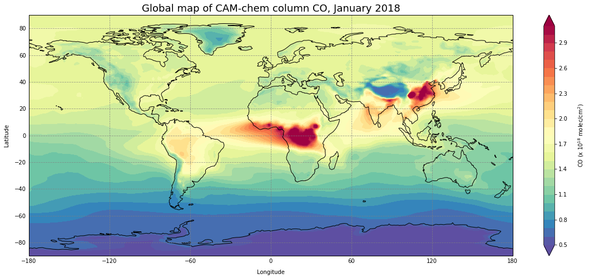

Example Map Plotting
====================

.. code:: ipython3

    # By line: RRB 2020-07-20
    # Script aims to:
    # - Load a netCDF file
    # - Extract one variable: CO
    # - Calculate column values: load model pressure, multiply by ppb -> column conversion factor
    # - Add cyclic point
    # - Create contour plot of variable as world map with coastlines
    # - Customize contours and colorbar
    # - Add axes labels
    # - Add grid lines

At the start of a Jupyter notebook you need to import all modules that you will use.
~~~~~~~~~~~~~~~~~~~~~~~~~~~~~~~~~~~~~~~~~~~~~~~~~~~~~~~~~~~~~~~~~~~~~~~~~~~~~~~~~~~~

.. code:: ipython3

    import matplotlib.pyplot as plt
    import cartopy.crs as ccrs                 # For plotting maps
    import cartopy.feature as cfeature         # For plotting maps
    from cartopy.util import add_cyclic_point  # For plotting maps
    from pathlib import Path                   # System agnostic paths
    import xarray as xr                        # For loading the data arrays
    import numpy as np                         # For array creation and calculations

Define the directories and file of interest for your results.
~~~~~~~~~~~~~~~~~~~~~~~~~~~~~~~~~~~~~~~~~~~~~~~~~~~~~~~~~~~~~

.. code:: ipython3

    result_dir = Path("../../data")
    file = "CAM_chem_merra2_FCSD_1deg_QFED_monthoutput_CO_201801.nc"
    file_to_open = result_dir / file
    #the netcdf file is now held in an xarray dataset named 'nc_load' and can be referenced later in the notebook
    nc_load = xr.open_dataset(file_to_open)
    #to see what the netCDF file contains, uncomment below
    #nc_load

Extract the variable of choice at the time and level of choice.
~~~~~~~~~~~~~~~~~~~~~~~~~~~~~~~~~~~~~~~~~~~~~~~~~~~~~~~~~~~~~~~

.. code:: ipython3

    #extract variable
    var_sel = nc_load['CO'].isel(time=0)
    #print(var_sel)
    
    #select the surface level at a specific time and convert to ppbv from vmr
    #select the surface level for an average over three times and convert to ppbv from vmr
    var_sel = var_sel*1e09 # 10-9 to ppb
    print(var_sel.shape)
    
    #extract grid variables
    lat = var_sel.coords['lat']
    lon = var_sel.coords['lon']

.. parsed-literal::

    (56, 192, 288)

Define constants for converting to column amounts.
~~~~~~~~~~~~~~~~~~~~~~~~~~~~~~~~~~~~~~~~~~~~~~~~~~

.. code:: ipython3

    #-------------------------------
    #CONSTANTS and conversion factor
    #-------------------------------
    NAv = 6.0221415e+23                       #--- Avogadro's number
    g = 9.81                                  #--- m/s - gravity
    MWair = 28.94                             #--- g/mol
    xp_const = (NAv* 10)/(MWair*g)*1e-09      #--- scaling factor for turning vmr into pcol
                                              #--- (note 1*e-09 because in ppb)

Create 3d Pressure array.
~~~~~~~~~~~~~~~~~~~~~~~~~

Calculates pressures at each hybrid level using the formula: p(k) =
a(k)\ *p0 + b(k)*\ ps.

.. code:: ipython3

    # Load values to create true model pressure array
    psurf = nc_load['PS'].isel(time=0)
    hyai = nc_load['hyai']
    hybi = nc_load['hybi']
    p0 = nc_load['P0']
    lev = var_sel.coords['lev']
    num_lev = lev.shape[0]
    
    # Initialize pressure edge arrays
    mod_press_low = xr.zeros_like(var_sel)
    mod_press_top = xr.zeros_like(var_sel)
    
    # Calculate pressure edge arrays
    # CAM-chem layer indices start at the top and end at the bottom
    for i in range(num_lev):
        mod_press_top[i,:,:] = hyai[i]*p0 + hybi[i]*psurf
        mod_press_low[i,:,:] = hyai[i+1]*p0 + hybi[i+1]*psurf
    
    # Delta P in hPa
    mod_deltap = (mod_press_low - mod_press_top)/100
    #print(mod_press_low[:,0,0])
    #print(mod_press_top[:,0,0])
    #print(mod_deltap[:,0,0])

Calculate columns.
~~~~~~~~~~~~~~~~~~

.. code:: ipython3

    var_tcol = xr.dot(mod_deltap, xp_const*var_sel, dims=["lev"])

Add cyclic point to avoid white stripe at lon=0.
~~~~~~~~~~~~~~~~~~~~~~~~~~~~~~~~~~~~~~~~~~~~~~~~

.. code:: ipython3

    var_tcol_cyc, lon_cyc = add_cyclic_point(var_tcol, coord=lon) 

Plot the value over the globe.
~~~~~~~~~~~~~~~~~~~~~~~~~~~~~~

.. code:: ipython3

    plt.figure(figsize=(20,8))
    
    #Define projection
    ax = plt.axes(projection=ccrs.PlateCarree())
    
    #define contour levels
    clev = np.arange(0.5, 3.2, 0.1)
    
    #plot the data
    plt.contourf(lon_cyc,lat,var_tcol_cyc/1e18,clev,cmap='Spectral_r',extend='both')
    
    # add coastlines
    ax.add_feature(cfeature.COASTLINE)
    
    #add lat lon grids
    gl = ax.gridlines(draw_labels=True, color='grey', alpha=0.8, linestyle='--')
    gl.xlabels_top = False
    gl.ylabels_right = False
    
    # Titles
    # Main
    plt.title("Global map of CAM-chem column CO, January 2018",fontsize=18)
    
    # y-axis
    ax.text(-0.04, 0.5, 'Latitude', va='bottom', ha='center',
            rotation='vertical', rotation_mode='anchor',
            transform=ax.transAxes)
    # x-axis
    ax.text(0.5, -0.08, 'Longitude', va='bottom', ha='center',
            rotation='horizontal', rotation_mode='anchor',
            transform=ax.transAxes)
    # legend
    ax.text(1.15, 0.5, 'CO (x 10$^{18}$ molec/cm$^{2}$)', va='bottom', ha='center',
            rotation='vertical', rotation_mode='anchor',
            transform=ax.transAxes)
    
    plt.colorbar()
    plt.show() 

